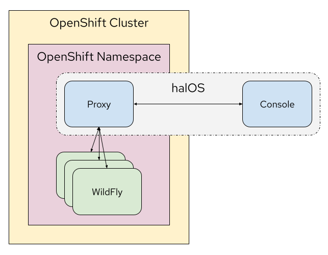

# halOS Console

halOS stands for **HAL** on **O**pen**S**hift. It is derived from [HAL](https://hal.github.io/)  and allows monitoring and inspection of WildFly and other services running on OpenShift. Although the focus is on WildFly, halOS supports monitoring arbitrary services. This is achieved through the concept of capabilities and extensions.

## Architecture



halOS consists of two parts:

1. [Proxy](https://github.com/hal/halos-proxy) (back-end)
2. Console (front-end, this repository)

This repository contains the console. The console is a [RIA](https://en.wikipedia.org/wiki/Rich_web_application) / [SPA](https://en.wikipedia.org/wiki/Single-page_application) following the design guidelines from [PatternFly](https://www.patternfly.org/v4/). It consumes the REST API exposed by the [proxy](https://github.com/hal/halos-proxy).

## Technical Stack

- [TypeScript](https://www.typescriptlang.org/)
- [React](https://reactjs.org/)
- [PatternFly](https://patternfly.org)

## Build

```shell
npm install
npm run build
```

## Development

Before starting the console in dev mode, make sure to start the [proxy](https://github.com/hal/halos-proxy) in [dev mode](https://github.com/hal/halos-proxy#development) as well. Then start the proxy in dev mode, using

```shell
npm run dev
```
